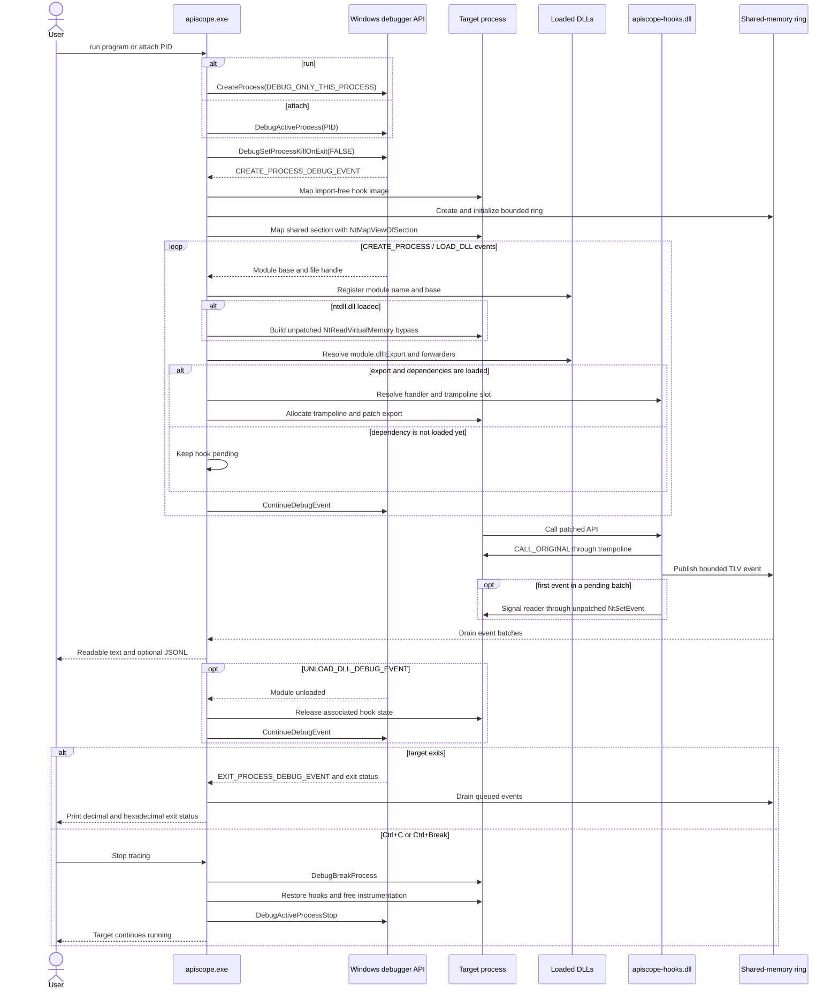

# ApiScope

[](https://github.com/sonx4444/apiscope/actions/workflows/build.yml)
[](https://github.com/sonx4444/apiscope/actions/workflows/codeql.yml)

ApiScope is a Windows x64 research tool for tracing selected API calls in a
new or running process. It follows DLL load events through the Windows debugger
API and installs hooks before the debuggee continues from each event.

Included hooks:

- `ntdll.dll!NtCreateFile`
- `ntdll.dll!NtReadFile`
- `ntdll.dll!NtWriteFile`
- `bcrypt.dll!BCryptOpenAlgorithmProvider`

## Demo

[](./demo/demo_run.mp4)

[Watch the MP4 video](./demo/demo_run.mp4).

## Build

Requirements:

- Windows x64
- Visual Studio 2019 or newer with the C++ workload
- CMake 3.20 or newer
- Git, used by CMake to fetch the pinned Zydis decoder

```powershell
cmake -S . -B build -A x64
cmake --build build --config Release
ctest --test-dir build -C Release --output-on-failure
powershell -ExecutionPolicy Bypass -File .\scripts\validate-apiscope-hooks.ps1 .\build\bin\Release\apiscope-hooks.dll
powershell -ExecutionPolicy Bypass -File .\scripts\smoke.ps1 -SkipBuild
```

Zydis v4.1.1 is fetched at a pinned commit and linked only into
`apiscope.exe`. The injected `apiscope-hooks.dll` remains import-free.

## Usage

```text
apiscope.exe [--help | --version | --list-hooks]
apiscope.exe run -k <module!export|all> [-k <module!export>] [-f text|jsonl] [-o <path>] [-q] -- <program> [args...]
apiscope.exe attach -p <pid> -k <module!export|all> [-k <module!export>] [-f text|jsonl] [-o <path>] [-q]
```

Hook names are always module-qualified. Module matching is case-insensitive;
export matching is case-sensitive.

```powershell
.\apiscope.exe run `
  --hook ntdll.dll!NtCreateFile `
  --hook bcrypt.dll!BCryptOpenAlgorithmProvider `
  -- C:\path\app.exe

.\apiscope.exe attach --pid 4242 --hook all

.\apiscope.exe run --hook all --format jsonl --output trace.jsonl --quiet -- app.exe
```

Terminal events remain readable while `--output` optionally tees text or JSONL
to a file. `--quiet` suppresses the terminal event mirror.

```text
[*] ntdll.dll!NtWriteFile ----------
    timestamp      : 2026-06-07T17:44:23.3834340Z
    thread_id      : 3508
    sequence       : 3
    file_handle    : 0x000000000000008C
    length         : 16
    buffer_text    : Hello, ApiScope!
    result         : 0x00000000
```

JSONL events contain generic metadata and hook-local fields:

```json
{"sequence":1,"module":"bcrypt.dll","api":"BCryptOpenAlgorithmProvider","hook":"bcrypt.dll!BCryptOpenAlgorithmProvider","fields":{"flags":0,"result":{"type":"status","value":0,"hex":"0x00000000"}}}
```

Press Ctrl+C or Ctrl+Break to restore active hooks, release remote
instrumentation, and detach. The target continues running. On natural exit,
ApiScope prints the target status in decimal and hexadecimal.

## Adding A Hook

Each hook is one file under `src/apiscope-hooks/hooks/` and declares its source
module, export, handler, trampoline slot, calling convention, and signature
together:

```cpp
DEFINE_API_HOOK(
    BCryptOpenAlgorithmProvider,
    "bcrypt.dll",
    "BCryptOpenAlgorithmProvider",
    NTSTATUS,
    WINAPI,
    PVOID* Algorithm,
    const wchar_t* AlgorithmId,
    const wchar_t* Implementation,
    ULONG Flags) {
    TraceEvent event;
    InitializeTraceEvent(&event, "bcrypt.dll", "BCryptOpenAlgorithmProvider");
    AddTraceUInt32(&event, "flags", Flags);

    NTSTATUS result = CALL_ORIGINAL(
        BCryptOpenAlgorithmProvider,
        Algorithm,
        AlgorithmId,
        Implementation,
        Flags);
    AddTraceStatus(&event, "result", result);
    EmitTraceEvent(&event);
    return result;
}
```

`apiscope.exe --list-hooks` discovers fixed-layout descriptors exported by the
hook DLL. No central API list or launcher-side event schema is required.

## How It Works



The controller creates a paging-file-backed section and maps it into both
processes. Hook threads publish to a fixed-capacity, multi-producer ring using
per-slot sequence numbers. An unpatched `NtSetEvent` bypass sends one coalesced
wakeup for each pending batch, and the controller drains events in batches.
Producers never wait for the reader; a full ring drops and counts the event.
Buffer previews still use an unpatched `NtReadVirtualMemory` bypass so invalid
target pointers fail without crashing the hook.

## Project Layout

```text
cmake/                 Dependency configuration
scripts/               Validation and runtime smoke tests
src/apiscope/          CLI, debugger, mapper, patcher, and renderer
src/apiscope-hooks/    Import-free hook DLL and standalone hooks
src/include/           Shared contracts
tests/                 Unit and runtime test targets
```

## Limitations

- Windows x64 only; controller and target architecture must match.
- Only one ApiScope session should instrument a target.
- The debugger may require elevation for protected or elevated targets.
- Unsupported trampoline relocation fails closed.
- Ordinal export forwarders are not supported.
- The manual mapper is specific to the import-free hook image.
- If ApiScope is forcibly terminated, `DebugSetProcessKillOnExit(FALSE)` keeps
  the target alive, but hooks and mapped instrumentation remain resident until
  the target exits.
- Instrumenting process internals can trigger endpoint security products.

Use ApiScope only on systems and processes you are authorized to inspect. See
[SECURITY.md](SECURITY.md), [CONTRIBUTING.md](CONTRIBUTING.md), and
[ROADMAP.md](ROADMAP.md).

## License

[MIT](LICENSE). Third-party components retain their licenses; see
[THIRD_PARTY_NOTICES.md](THIRD_PARTY_NOTICES.md).
