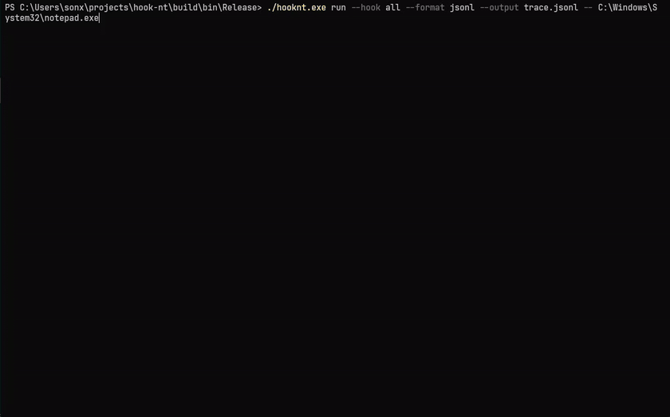
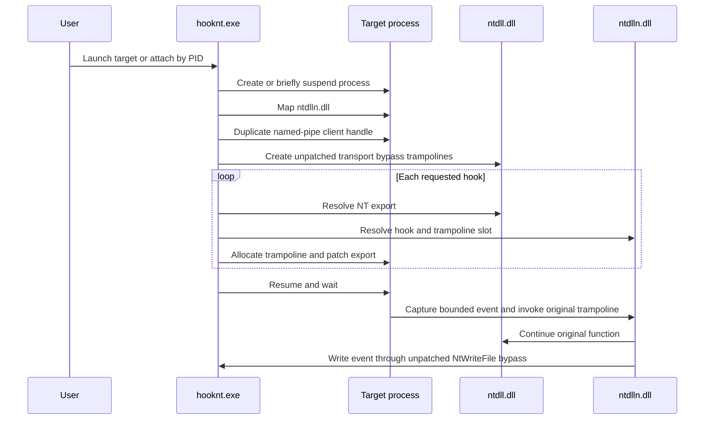

# HookNt

[](https://github.com/sonx4444/hook-nt/actions/workflows/build.yml)
[](LICENSE)

HookNt is a small Windows x64 research tool for observing selected NT file APIs in a process launched under its control or attached by PID. It maps an import-free hook DLL, installs trampolines in `ntdll.dll`, and sends structured events to the launcher over a named pipe.

## Quick Start

Requirements:

- Windows x64
- Visual Studio 2019 or newer with the C++ workload
- CMake 3.20 or newer
- Git, used by CMake to fetch DiStorm when the submodule is absent

Build and run the end-to-end smoke test:

```powershell
powershell -ExecutionPolicy Bypass -File .\scripts\smoke.ps1
```

Or build manually:

```cmd
build.bat
cd build\bin\Release
hooknt.exe run -k all -- test_file_ops.exe
```

`build.bat` configures a Release build, compiles the project, validates the injected DLL contract during the build, and runs the CTest suite.

## Demo

Trace Notepad while teeing structured JSONL events to `trace.jsonl`:

```cmd
.\hooknt.exe run --hook all --format jsonl --output trace.jsonl -- C:\Windows\System32\notepad.exe
```



[View the MP4 recording](./imgs/demo_run.mp4).

Example terminal output:

```text
[*] NtWriteFile ----------
    timestamp     : 2026-06-01T12:34:56.1234567Z
    thread_id     : 4240
    sequence      : 3
    dropped_before: 0
    file_handle   : 0x000000000000004C
    length        : 14
    buffer        : 48 65 6C 6C 6F 2C 20 48 6F 6F 6B 4E 74 21
    buffer_text   : Hello, HookNt!
    buffer_status : 0x00000000
    result        : 0x00000000
```

## Supported Hooks

```text
NtCreateFile
NtReadFile
NtWriteFile
```

Usage:

```text
hooknt.exe [--help | --version | --list-hooks]
hooknt.exe run -k <name|all> [-k <name>] [-f text|jsonl] [-o <path>] [-q] -- <program> [args...]
hooknt.exe attach -p <pid> -k <name|all> [-k <name>] [-f text|jsonl] [-o <path>] [-q]
```

Short options map directly to their long forms: `-h` is `--help`, `-V` is `--version`, `-l` is `--list-hooks`, `-k` is `--hook`, `-f` is `--format`, `-o` is `--output`, and `-q` is `--quiet`.

Attach to an existing process and log until it exits:

```cmd
hooknt.exe attach -p 4242 -k all -f jsonl -o trace.jsonl
```

Attach briefly suspends the target while the DLL, transport, and hooks are installed, then resumes it. The target must be a Windows x64 process that the current user can open with query, VM, duplicate-handle, synchronization, and suspend/resume rights. Elevated targets may require running `hooknt.exe` from an elevated terminal.

`--list-hooks` discovers supported hooks from exported symbol pairs in `ntdlln.dll`. `--hook all` enables every discovered hook. Trace events are rendered as readable text in the terminal. `--output` tees events to a file, with optional JSONL formatting. `--format` is used only with `--output`:

```cmd
hooknt.exe run --hook all --format jsonl --output trace.jsonl -- test_file_ops.exe
```

Use `--quiet` with `--output` to suppress the terminal event mirror. Unsupported hook names fail before a target process is launched or suspended.

JSONL events use the same generic fields emitted by each hook:

```json
{"sequence":3,"dropped_before":0,"timestamp":"2026-06-01T12:34:56.1234567Z","timestamp_100ns":134247908961234567,"thread_id":4240,"api":"NtWriteFile","status":0,"truncated":false,"field_error":false,"fields":{"file_handle":136,"length":14,"buffer":{"type":"bytes","requested":14,"captured":14,"capture_status":0,"hex":"48656C6C6F2C20486F6F6B4E7421","text":"Hello, HookNt!"}}}
```

## Adding A Hook

Each hook is a standalone file under `src/ntdlln/hooks/`. A hook is available automatically when the DLL exports a matching pair:

```text
NtNewFunctionN
NtNewFunctionTrampoline
```

Use `DEFINE_NT_HOOK` and `CALL_ORIGINAL` from `nt_hook.h`. Emit a bounded protocol event through `trace_transport.h`:

```cpp
#include "nt_hook.h"
#include "trace_transport.h"

DEFINE_NT_HOOK(NtNewFunction, HANDLE Handle) {
    TraceEvent event;
    InitializeTraceEvent(&event, "NtNewFunction");
    AddTracePointer(&event, "handle", Handle);
    NTSTATUS result = CALL_ORIGINAL(NtNewFunction, Handle);
    event.header.status = result;
    EmitTraceEvent(&event);
    return result;
}
```

The event builder supports pointers, `uint32`, `uint64`, NT status values, and bounded buffer previews. Field names use lower `snake_case`. Events are self-describing, so no central schema table, renderer branch, or launcher allowlist needs editing. Rebuild and verify registration:

```cmd
hooknt.exe --list-hooks
```

## How It Works



The hook DLL has no imports, TLS callbacks, or entry point, matching the minimal mapper's contract. It writes self-describing binary TLV events with an unpatched `NtWriteFile` bypass, so tracing `NtWriteFile` does not recurse. Every event receives a hook-entry timestamp from the shared user-data page and the originating thread ID from the x64 TEB. Each event uses only its initialized bytes within a fixed 1024-byte stack capacity. Buffer previews use an unpatched `NtReadVirtualMemory` bypass and stay bounded at 64 bytes. Pipe writes are nonblocking; events are dropped and counted when the reader cannot keep up.

The patcher disassembles complete instructions until it has enough bytes for an x64 absolute jump. It rejects RIP-relative and relative-control-flow instructions because copied trampoline instructions are not relocated yet.

## Project Layout

```text
cmake/              DiStorm dependency configuration
scripts/            End-to-end smoke test
src/hooknt/         Launcher, mapper, and patcher
src/ntdlln/         Injected hook DLL and standalone hook modules
src/include/        Shared headers
tests/              CTest targets
```

## Build And Test

```powershell
cmake -S . -B build -A x64
cmake --build build --config Release
ctest --test-dir build -C Release --output-on-failure
powershell -ExecutionPolicy Bypass -File .\scripts\validate-ntdlln.ps1 .\build\bin\Release\ntdlln.dll
powershell -ExecutionPolicy Bypass -File .\scripts\smoke.ps1 -SkipBuild
```

DiStorm is fetched automatically at its pinned commit when `libs/distorm` is not initialized. Existing submodule checkouts continue to work.

The smoke suite covers suspended launch, short CLI aliases, JSONL tee output, quiet mode, concurrent file operations, and attach-by-PID against a running multithreaded target.

## Limitations

- Windows x64 only.
- Attach setup briefly suspends the target process.
- Attach logging currently runs until target exit; stopping `hooknt.exe` early does not unload instrumentation from the target.
- Only one HookNt session should instrument a target at a time.
- Supports three NT file APIs.
- Uses bounded self-describing protocol events and 64-byte buffer previews.
- Drops trace events instead of blocking the target when the pipe is full.
- Rejects trampolines that require instruction relocation.
- Uses a minimal manual mapper intended for this hook DLL, not a general-purpose reflective loader.
- Hooking security-sensitive process internals can trip endpoint security products.

Use HookNt only on systems and processes you are authorized to test. See [SECURITY.md](SECURITY.md) and [ROADMAP.md](ROADMAP.md).

## License

[MIT](LICENSE)
