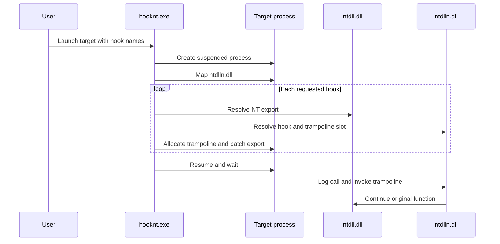

# HookNt

[](https://github.com/sonx4444/hook-nt/actions/workflows/build.yml)
[](LICENSE)

HookNt is a small Windows x64 research tool for observing selected NT file APIs in a process launched under its control. It injects a hook DLL, installs trampolines in `ntdll.dll`, and logs calls with bounded buffer previews.


## Quick Start

Requirements:

- Windows x64
- Visual Studio 2019 or newer with the C++ workload
- CMake 3.20 or newer
- Git, used by CMake to fetch DiStorm when the submodule is absent

Build and run the end-to-end smoke test:

```powershell
powershell -ExecutionPolicy Bypass -File .\scripts\smoke.ps1
```

Or build manually:

```cmd
build.bat
cd build\bin\Release
hooknt.exe test_file_ops.exe NtCreateFile NtWriteFile NtReadFile
```

Example runtime output:

```text
[*] NtWriteFile
  \Buffer (hex): 48 65 6C 6C 6F 2C 20 48 6F 6F 6B 4E 74 21
  \Buffer (text): Hello, HookNt!
  \Length       : 14
  ---------------> 0x00000000
```

## Supported Hooks

```text
NtCreateFile
NtReadFile
NtWriteFile
```

Usage:

```text
hooknt.exe <target_program> <nt_function1> <nt_function2> ...
hooknt.exe --list-hooks
```

`--list-hooks` discovers supported hooks from exported symbol pairs in `ntdlln.dll`. Unsupported hook names fail before a target process is launched.

## Adding A Hook

Each hook is a standalone file under `src/ntdlln/hooks/`. A hook is available automatically when the DLL exports a matching pair:

```text
NtNewFunctionN
NtNewFunctionTrampoline
```

Use `DEFINE_NT_HOOK` and `CALL_ORIGINAL` from `nt_hook.h`:

```cpp
#include "logger.h"
#include "nt_hook.h"

DEFINE_NT_HOOK(NtNewFunction, HANDLE Handle) {
    printfN("\n[*] NtNewFunction\n");
    return CALL_ORIGINAL(NtNewFunction, Handle);
}
```

No central source list, declaration header, or launcher allowlist needs editing. Rebuild and verify registration:

```cmd
hooknt.exe --list-hooks
```

## How It Works



The patcher disassembles complete instructions until it has enough bytes for an x64 absolute jump. It rejects RIP-relative and relative-control-flow instructions because copied trampoline instructions are not relocated yet.

## Project Layout

```text
cmake/              DiStorm dependency configuration
scripts/            End-to-end smoke test
src/hooknt/         Launcher, mapper, and patcher
src/ntdlln/         Injected hook DLL and standalone hook modules
src/include/        Shared headers
tests/              CTest targets
```

## Build And Test

```powershell
cmake -S . -B build -A x64
cmake --build build --config Release
ctest --test-dir build -C Release --output-on-failure
powershell -ExecutionPolicy Bypass -File .\scripts\smoke.ps1 -SkipBuild
```

DiStorm is fetched automatically at its pinned commit when `libs/distorm` is not initialized. Existing submodule checkouts continue to work.

## Limitations

- Windows x64 only.
- Launches a new process; attaching to an existing PID is not implemented.
- Supports three NT file APIs.
- Rejects trampolines that require instruction relocation.
- Uses a minimal manual mapper intended for this hook DLL, not a general-purpose reflective loader.
- Hooking security-sensitive process internals can trip endpoint security products.

Use HookNt only on systems and processes you are authorized to test. See [SECURITY.md](SECURITY.md) and [ROADMAP.md](ROADMAP.md).

## License

[MIT](LICENSE)
